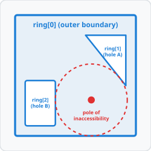

<p align="center">
  
</p>

<h1 align="center">Polylabel C#</h1>

<p align="center">
  A blazing fast, zero-allocation C# port of <a href="https://github.com/mapbox/polylabel">Mapbox Polylabel</a>.
  Finds the <b>pole of inaccessibility</b> (the optimal point inside a polygon for label placement) with extreme speed and surgical precision.
</p>

<p align="center">
  
  
  
</p>

## Key Features

* **Zero Heap Allocations:** All core data structures use stack-allocated value types to eliminate garbage collection pressure.
* **Peak Performance:** Leverages native priority queues and span slices for ultra-fast execution.
* **Broad Compatibility:** Targets .NET 8.0 and .NET 10.0 — works in Rhino 8 and other .NET 8 hosts, while also supporting the latest runtime.
* **Flexible API:** Native support for both high-performance double arrays and standard GeoJSON coordinate structures.
* **Custom Point Support:** Use your own point/vector class with zero overhead.

## Installation

Install the library directly from [NuGet](https://www.nuget.org/):

```bash
dotnet add package Polylabel
```

Or via the Package Manager Console:

```powershell
Install-Package Polylabel
```

## Usage

A polygon is modeled as a list of closed rings. The first ring defines the outer boundary, while subsequent optional rings define holes.

<p align="center">
  
</p>

```csharp
using Polylabel;

// 1. Define a polygon with an outer ring and two holes (matching the diagram above)
var outerRing = new Point[]
{
    new Point(15, 15),
    new Point(135, 15),
    new Point(135, 135),
    new Point(15, 135),
    new Point(15, 15)
};

var holeA = new Point[]
{
    new Point(85, 35),
    new Point(125, 35),
    new Point(125, 85),
    new Point(85, 35)
};

var holeB = new Point[]
{
    new Point(25, 80),
    new Point(55, 80),
    new Point(55, 125),
    new Point(25, 125),
    new Point(25, 80)
};

var polygon = new Polygon(new Point[][] { outerRing, holeA, holeB });

// 2. Find the pole of inaccessibility
var (point, distance) = Polylabel.Run(polygon, precision: 0.01);

Console.WriteLine($"Optimal label position: X={point.X}, Y={point.Y}"); // Output: X=90.7, Y=99.3
Console.WriteLine($"Distance to closest boundary: {distance}");         // Output: Distance=35.7
```

### Interoperability

Polylabel easily handles raw coordinate arrays directly from GeoJSON serializers:

```csharp
double[][][] geoJsonCoordinates = ...; // Outer boundary and hole coordinates
var polygon = new Polygon(geoJsonCoordinates);

var (point, distance) = Polylabel.Run(polygon, precision: 0.1);
```

### Custom Types

If your application already uses a custom vector or point class (such as Unity's `Vector2` or a custom GIS coordinate struct), you can use it directly with Polylabel without any performance loss.

Simply implement the `IPoint` interface on your custom struct, and pass it to a generic `Polygon<TPoint>`:

```csharp
using Polylabel;

// 1. Implement IPoint on your custom class or struct
public readonly struct CustomVector2 : IPoint
{
    public double X => XCoordinate;
    public double Y => YCoordinate;

    public double XCoordinate { get; }
    public double YCoordinate { get; }

    public CustomVector2(double x, double y)
    {
        XCoordinate = x;
        YCoordinate = y;
    }
}

// 2. Wrap custom coordinates in a generic Polygon
CustomVector2[][] myRings = ...;
var polygon = new Polygon<CustomVector2>(myRings);

// 3. Find the pole (compiler generates optimized zero-overhead code paths)
var (point, distance) = Polylabel.Run(polygon, precision: 1.0);
```

If the point class comes from an external package (like `System.Numerics.Vector2` or Unity's `Vector2`) and cannot be modified, you can define a lightweight, stack-allocated adapter struct.

Since C# value types are stack-allocated, this wrapper has zero runtime overhead and is fully inlined by the RyuJIT compiler:

```csharp
// 1. External class from another package (cannot implement IPoint directly)
using System.Numerics; // e.g., Vector2

// 2. Define a zero-allocation adapter struct
public readonly struct Vector2Adapter : IPoint
{
    private readonly Vector2 _vector;

    public double X => _vector.X;
    public double Y => _vector.Y;

    public Vector2Adapter(Vector2 vector) => _vector = vector;
}

// 3. Map your rings (fully stack-allocated and completely free of GC pressure)
Vector2[][] externalRings = ...;
Vector2Adapter[][] wrappedRings = Array.ConvertAll(externalRings,
    ring => Array.ConvertAll(ring, v => new Vector2Adapter(v)));

var polygon = new Polygon<Vector2Adapter>(wrappedRings);
var (point, distance) = Polylabel.Run(polygon);
```

You can also define custom polygon structures by implementing the generic `IPolygon<TPoint>` interface.

This enables accessing coordinates as `ReadOnlySpan<TPoint>` directly from foreign memory or native GIS structures, completely avoiding allocation and memory copy overheads:

```csharp
using Polylabel;

// 1. Define a zero-allocation polygon adapter
public readonly struct MyCustomPolygon : IPolygon<Point>
{
    private readonly Point[] _outerRing;

    public int RingCount => 1;

    public ReadOnlySpan<Point> GetRing(int index) => index == 0 ? _outerRing : ReadOnlySpan<Point>.Empty;

    public MyCustomPolygon(Point[] outerRing) => _outerRing = outerRing;
}

// 2. Pass directly to the generic Run method (0% runtime overhead)
var polygon = new MyCustomPolygon(outerRingPoints);
var (point, distance) = Polylabel.Run<MyCustomPolygon, Point>(polygon);
```

## Benchmarks

Executed on an **Apple M1 Pro** under **.NET 10.0**:

| Benchmark Case | Polygon Complexity | Search Precision | Mean Execution Time | Allocated Memory | Calculated Pole (Result) |
| :--- | :--- | :--- | :--- | :--- | :--- |
| **`Water1` (GIS Dataset)** | 25 Rings, 3,073 Vertices | `1.0` | **7.77 ms** | **6.00 KB** | `[3865.85, 2124.88]` (dist: 288.85) |
| **`Water1` (Quick Search)**| 25 Rings, 3,073 Vertices | `50.0` | **5.29 ms** | **2.98 KB** | `[3854.30, 2123.83]` (dist: 278.58) |
| **`Water2` (GIS Dataset)** | 28 Rings, 2,831 Vertices | `1.0` | **3.34 ms** | **1.45 KB** | `[3263.50, 3263.50]` (dist: 960.50) |

*Note: The minimal memory allocated is solely for the initial creation of the priority queue object wrapper and its internal resize buffer. The main search loop operates entirely on the stack and incurs zero garbage collection pauses.*

### Native PriorityQueue vs Tinyqueue Comparison

We compare our library's native .NET `PriorityQueue` against a C# port of the original JavaScript `tinyqueue` package:

| Queue Implementation | Dataset | Mean Execution Time | Allocated Memory |
| :--- | :--- | :--- | :--- |
| **Native `PriorityQueue`** | `Water1` (25 Rings, 3,073 Vertices) | 7.77 ms | 6.00 KB |
| **Tinyqueue (JS Port)** | `Water1` (25 Rings, 3,073 Vertices) | **7.75 ms** | **5.02 KB** |
| **Native `PriorityQueue`** | `Water2` (28 Rings, 2,831 Vertices) | **3.34 ms** | **1.45 KB** |
| **Tinyqueue (JS Port)** | `Water2` (28 Rings, 2,831 Vertices) | 3.56 ms | 2.50 KB |

Both implementations are roughly equally fast.

### Visual Results

Below are the actual results of our test and benchmark datasets generated directly from the JSON fixtures.
Notice how the Polygon Centroid (blue cross) often falls outside the shape or in suboptimal narrow areas, whereas the Pole of Inaccessibility (red circle and its concentric maximum distance circle) finds the absolute optimal center point with millisecond speed.

<p align="center">
  
  
</p>

## License

This project is licensed under the **ISC License** – see the [LICENSE](LICENSE) file for details. Original algorithm copyright (c) 2016 Mapbox.
